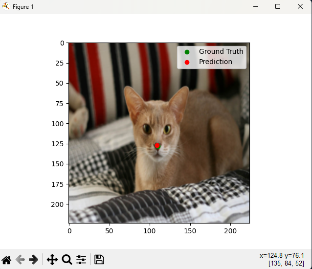
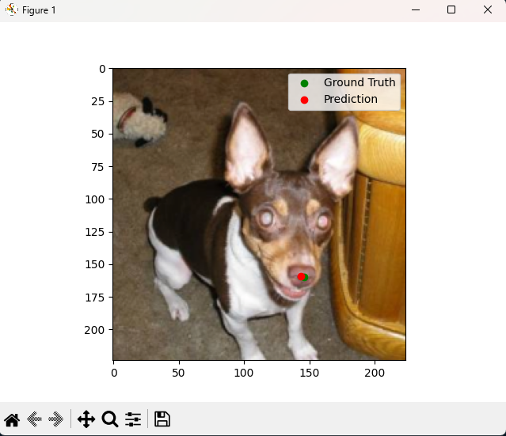
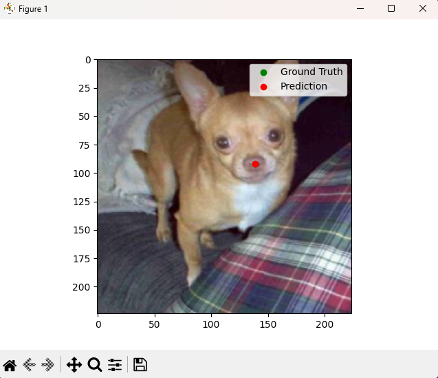

# ResNet Pet Nose Localization

### Using a modified version of ResNet 18 to create "NoseNet"; a model that is trained on a subset of the oxford-iiit-pets dataset to recognize the center of pets' noses.

## Here are more prediction results:
|   |  |
| --------------------------------------- | --------------------------------------- |
|   |  |

### [Final Report](ELEC475_Lab5_Report.pdf) 
